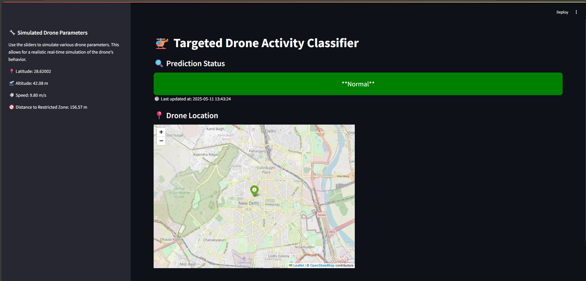
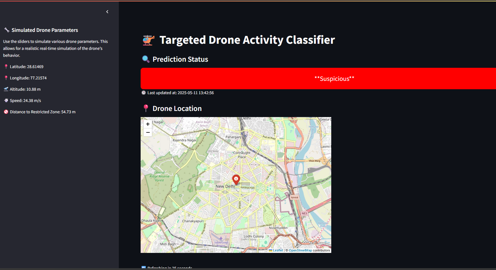

# Targeted Drone Activity Classifier

A real-time drone monitoring and classification system that simulates drone activity and uses a machine learning model (XGBoost) to classify whether drone behavior is **Normal** or **Suspicious** based on geospatial and flight data.

 <!-- optional -->

---


 <!-- optional -->

---

## Live Demo (optional)
*Coming soon* – or host via [Streamlit Cloud](https://streamlit.io/cloud) or locally.

---

## Features

- Simulates live drone coordinates, speed, altitude, and distance to restricted zones.
- Calculates derived features like speed/altitude ratio and proximity score.
- Uses a trained **XGBoost** model to classify drone activity which has 63% accuracy.
- Sends SMS alerts via **Twilio** if a suspicious drone is detected.
- Displays the drone's current location on an interactive **Folium map**.
- Auto-refreshes in real time with a custom delay.
- Logs the time of each prediction.

---

## Tech Stack

- Python
- Streamlit
- XGBoost
- Scikit-learn
- Pandas
- Folium
- Geopy
- Twilio (for alerts)

---
## How to Run

### 1. Clone the Repository
```bash
git clone https://github.com/Eshaj20/Drone_Simulation.git
cd Drone_Simulation

```
2. Install Dependencies
```bash
pip install -r requirements.txt
```
3. Set Up Environment Variables
Create a .env file:
```bash
TWILIO_ACCOUNT_SID=your_sid
TWILIO_AUTH_TOKEN=your_token
TWILIO_PHONE_NUMBER= twilio_number
ALERT_PHONE_NUMBER=your_phone_no
```

4. Run the App
```bash
streamlit run  drone_classifier.py

```

## Alerts
If a drone is classified as suspicious, an SMS alert is automatically sent using Twilio.

## Sample Features Used

- Latitude, Longitude
- Speed, Altitude
- Distance to restricted area
- Speed-to-Altitude Ratio
- Proximity Score
- Altitude-to-Distance Ratio
- Squared terms (non-linear modeling)

## Security Note
- All secrets should be stored in .env and excluded via .gitignore.
